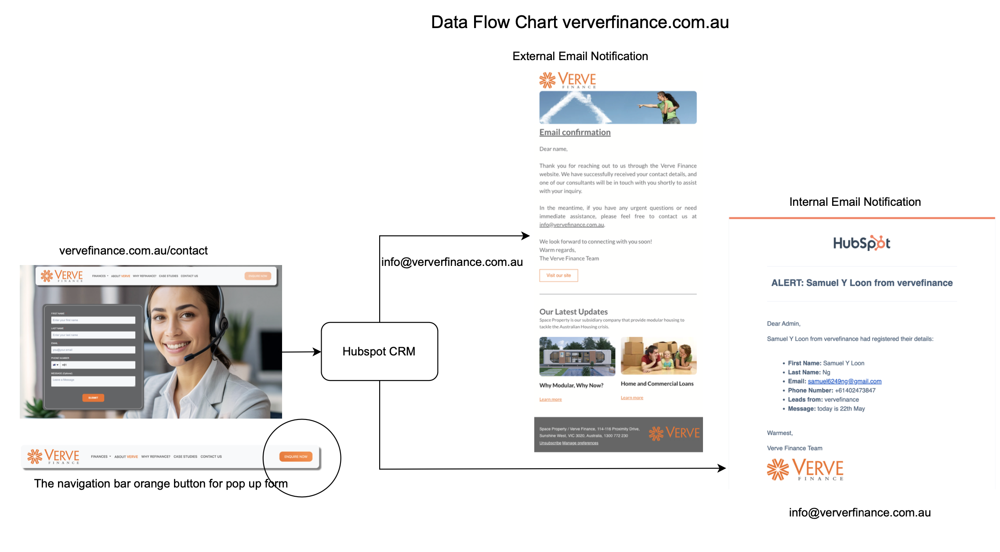

# Verve Finance Website



## Overview

Verve Finance's website is a PHP-based frontend application integrated with HubSpot CRM for lead management and customer communication. The platform provides financial services information and seamless client consultation booking.

## Technical Architecture

### Frontend

- **Technology**: PHP
- **Hosting**: Panthur
- **Key Features**:
  - Responsive design
  - Interactive loan calculators
  - Dynamic content management
  - Mobile-first approach
  - Animated UI components

### Backend Integration

- **CRM Platform**: HubSpot
- **Form Processing**: HubSpot Forms
- **Data Flow**:
  1. User submits consultation request
  2. Data captured via HubSpot Forms
  3. Automatic entry creation in HubSpot CRM
  4. Notification system triggers

### Notification System

- **Internal Notifications**: Staff receives real-time alerts
- **External Notifications**: Automated client confirmation emails
- **Integration**: HubSpot's email automation system

## Project Structure

## Key Features

- **Dynamic Form Integration**: Seamless HubSpot form embedding
- **Responsive Navigation**: Mobile-friendly menu system
- **Interactive Elements**: Animated components and transitions
- **Service Sections**:
  - Home Loans
  - Investment Properties
  - Refinancing Options
  - First Home Buyers

## Development Setup

1. Clone the repository
2. Configure local PHP environment
3. Set up HubSpot form credentials
4. Update configuration files

```bash
# Example local setup
php -S localhost:8000
```

## Deployment

1. Ensure all files are properly versioned
2. Upload to Panthur hosting via FTP/SSH
3. Verify HubSpot integration
4. Test form submissions
5. Confirm email notifications

## HubSpot Integration

```php
<!-- Example HubSpot Form Integration -->
<script src="https://js.hsforms.net/forms/embed/v2.js"></script>
<div class="hubspot-form-container"
     data-form-id="your-form-id"
     data-portal-id="your-portal-id">
</div>
```

## Maintenance

- Regular PHP version updates
- HubSpot form maintenance
- Content updates via CMS
- Security patches
- Performance optimization

## Browser Support

- Chrome (latest)
- Firefox (latest)
- Safari (latest)
- Edge (latest)
- Mobile browsers

## Performance Optimization

- Image optimization
- CSS minification
- JavaScript bundling
- Caching implementation
- Lazy loading

## Security Measures

- HTTPS enforcement
- Form validation
- Data encryption
- Regular security audits
- Backup systems

## Contact & Support

For technical support or inquiries:

- Email: info@vervefinance.com.au
- Location: 114-116 Proximity Drive, Sunshine West, VIC 3020

## License

Proprietary - All rights reserved

## Contributors

- Development Team
- Design Team
- Content Team
- HubSpot Integration Specialists

## Version History

- v1.0.0 - Initial Release
- v1.1.0 - HubSpot Integration
- v1.2.0 - Mobile Optimization
- v1.3.0 - Performance Updates

## Acknowledgments

- HubSpot Developer Community
- PHP Community
- Design Resources
- Testing Team

---

verve-finance/
├── components/ # PHP components (nav, footer, etc.)
│ ├── banner.php
│ ├── footer.php
│ └── nav.php
├── css/ # Stylesheet files
├── images/ # Image assets
├── pages/ # Main page templates
└── layout.php # Master layout file

© 2025 Verve Finance. All Rights Reserved.
